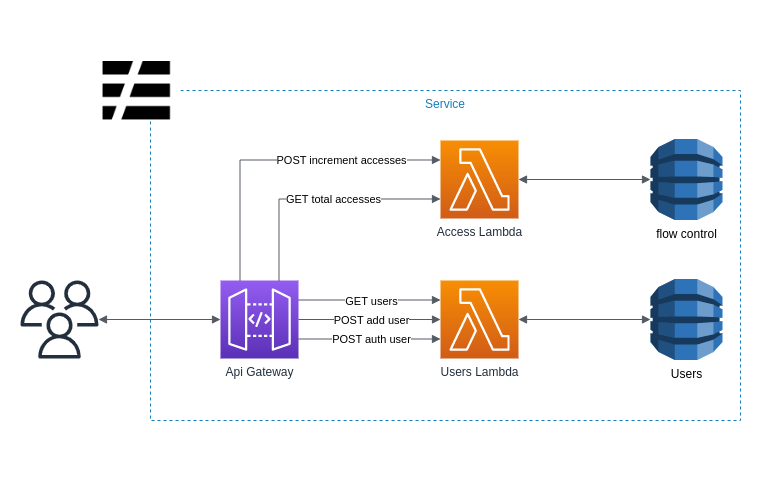

# Desafio Stone/Ton

## Code challenge para Desenvolvedor Backend

Desafio de implementação serverless para vaga de desenvolvedor backend

## O que precisava ser feito

- Criar uma rota para incrementar o número de acessos (utilizar o [countApi.xyz](https://countapi.xyz))
- Criar uma rota para consultar o número de acessor (utilizar o [countApi.xyz](https://countapi.xyz))
- Criar uma rota para criar um usuário
- Criar uma rota para visualizar as informações de um usuário

## Observações sobre o countApi

A api não estava funcionando durante o período proposto para a realização do desafio, conforme foi informado para os responsáveis pela vaga, fiz a implementação das rotas sem utilizar a integração com uma api externa, criando assim uma tabela no DynamoDB exclusiva para essas rotas.

## Diagrama de infraestrutura
Foram utilizados serviços da aws e o framework serverless para a criação da infraestrutura de forma programática, utilizando um API Gateway para prover os endpoints para os usuários, uma lambda para o serviço de Usuários e outra lambda para o contador de acessos, cada uma acessando uma tabela diferente do DynamoDB.

## rotas criadas
As rotas criadas estão descritas mais detalhadamente no swagger, que são as seguintes:
- [GET]  /user (Lista o nome de todos os usuários)
- [POST] /user (Cria um novo usuário)
- [POST] /auth (Autentica o usuário com base na senha e mostra todos os dados do mesmo)
- [GET]  /access (Exibe a quantidade de acessos)
- [POST] /access (Incrementa a quantidade de acessos)

## Dependências de produção

- "bcryptjs" para encriptar e validar a senha do usuário

## Dependências de desenvolvimento

Foram utilizadas algumas dependências de tipagem "@types/*" que não serão detalhadas aqui para fins de manter a documentação mais concisa.

- "aws-sdk/client-dynamodb" para conexão com o DynamoDB
- "jest" para testes unitários e e2e
- "supertest" para testes e2e
- "prettier" para padronização de formatação do código
- "serverless" para gerar a infraestrutura na cloud AWS
- "serverless-auto-swagger" para gerar a documentação da API com base em interfaces e no arquivo `serverless.yml`
- "serverless-dotenv-plugin" para utilizar um arquivo `.env` para lidar com variáveis de ambiente
- "serverless-offline" para rodar as lambdas localmente
- "serverless-plugin-typecript" para possibilitar a utilização do typescript em ambiente de desenvolvimento
- "ts-jest" para possibilitar a utilização de typescript nos testes
- "ts-node" para possibilitar a utilização de typescript nos testes
- "typescript" para utlizar o typescript em ambiente de desenvolvimento

## Observações sobre as dependências

Não foi necessário utilizar a dependência "@aws-sdk/client-dynamodb" como dependência de produção pois a infraestrutura provida pela AWS já contem esse pacote disponível globalmente.

Não foi utilizada a biblioteca "dynamodb-local" por conta de falhas críticas de segurança e não existir uma real necessidade nesse projeto de ter uma instância exclusiva do banco localmente.

## Dependências globais

instalar o serverless globalmente com
  - `npm install -g serverless`

## Como rodar em ambiente de desenvolvimento

- Criar um arquivo `.env` preenchendo as variáveis de ambiente levando como exemplo o arquivo `.env.example`

- Para criar as dependências do DynamoDB na AWS é necessário rodar no terminal o seguinte comando:
  - `sls deploy`
  - 
- Para criar as lambdas localmente rodar:
  - `sls offline`

Ao finalizar a execução o serverless irá exibir as rotas disponíveis para o acesso através do `localhost`

## como rodar em ambiente de produção

- Criar um arquivo `.env` preenchendo as variáveis de ambiente levando como exemplo o arquivo `.env.example`

- excluir a pasta `.build` caso ela exista

Rodar o seguinte comando no terminal: 
`sls deploy --stage prod`

Ao finalizar a execução o serverless irá exibir as rotas disponíveis para o acesso através da AWS
